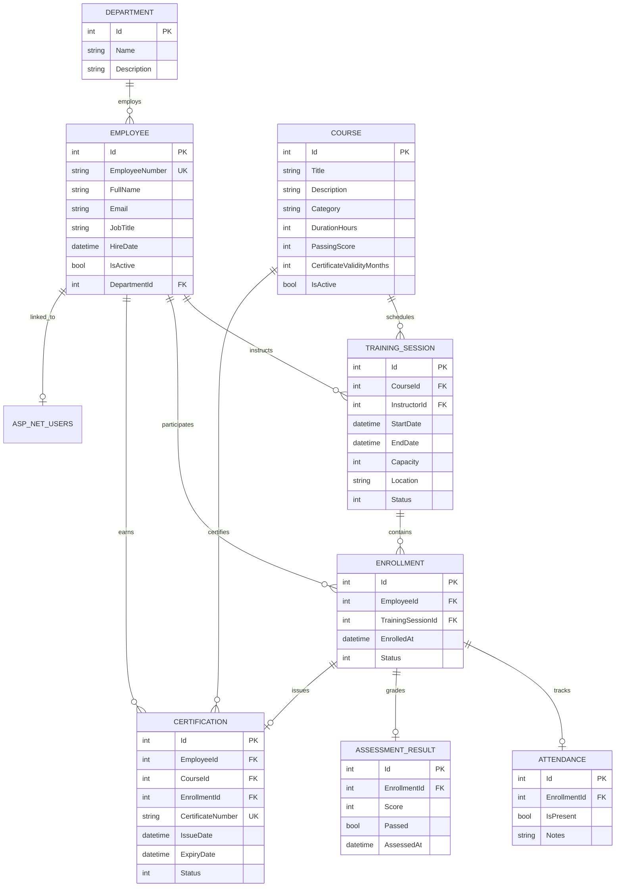

# Corporate Training & Certification Management System

A production-grade web application built with **ASP.NET Core MVC**, **Entity Framework Core**, and **Microsoft SQL Server**, implementing **Vertical Slice Architecture**, **Repository & Unit of Work patterns**, and **ASP.NET Core Identity** with role-based authorization.

Designed and developed for the Technical Internship Project Assignment by **Hazem Hisham**.

---

## Table of Contents
1. [Project Overview](#project-overview)
2. [Technology Stack](#technology-stack)
3. [Architecture & Design Principles](#architecture--design-principles)
   - [Vertical Slice Architecture](#vertical-slice-architecture)
   - [Generic Repository & Unit of Work](#generic-repository--unit-of-work)
4. [Business Roles & Permissions](#business-roles--permissions)
5. [Business Rules Enforced (BR-01 to BR-08)](#business-rules-enforced-br-01-to-br-08)
6. [Data Model & Database Design (ERD)](#data-model--database-design-erd)
7. [Getting Started & Setup](#getting-started--setup)
   - [Prerequisites](#prerequisites)
   - [Configuration](#configuration)
   - [Database Migrations & Seeding](#database-migrations--seeding)
   - [Running the Application](#running-the-application)
8. [Default Demo Accounts](#default-demo-accounts)
9. [Key User Workflows](#key-user-workflows)
10. [Automated Testing](#automated-testing)
11. [SQL Server Queries & Reports](#sql-server-queries--reports)
12. [Project Structure](#project-structure)

---

## Project Overview

The **Corporate Training & Certification Management System** streamlines end-to-end organizational learning, from scheduling training sessions and managing employee enrollments to tracking attendance, grading assessments, issuing digital certifications, and monitoring expiry dates.

### Core Capabilities:
- **Employee & Department Management:** Maintain employee records, job titles, department assignments, and active statuses.
- **Course Catalog Management:** Configure training courses with duration, categories, passing score criteria, and certificate validity duration.
- **Session Scheduling:** Plan training sessions with instructors, dates, and strict capacity enforcement.
- **Enrollment Workflow:** Self-enrollment for employees and administrative enrollments for managers, guarded against duplicate enrollments and overbooking.
- **Attendance & Assessment:** Record attendance and score employee exams (0–100) with automatic pass/fail evaluation.
- **Certification Lifecycle:** Automatic generation of unique certificate numbers (`CERT-yyyyMMdd-XXXXX`), validity expiry calculation, and status tracking (`Valid`, `ExpiringSoon`, `Expired`).

---

## Technology Stack

| Layer / Concern | Technology | Justification |
|---|---|---|
| **Framework** | ASP.NET Core 10.0 MVC | High-performance, modern cross-platform web framework |
| **Language** | C# 14 / .NET 10 | Strong typing, async/await idioms, modern language features |
| **Database** | Microsoft SQL Server / LocalDB | Enterprise relational database ensuring ACID transactions and data integrity |
| **ORM** | Entity Framework Core 10.0 | Code-First migrations, expressive LINQ queries, and relational mapping |
| **Security & Auth** | ASP.NET Core Identity | Cookie authentication, password hashing, and role-based authorization |
| **Validation** | FluentValidation 12.1.1 | Decoupled, fluent, and testable command/input validation rules |
| **Testing** | xUnit & Moq | Unit testing business handlers in isolation from database dependencies |
| **Frontend UI** | Razor Views + Bootstrap 5 + Custom CSS | Responsive enterprise UI with rich dashboards, badges, and modal filters |

---

## Architecture & Design Principles

### Vertical Slice Architecture
Instead of rigid horizontal layering where logic is split across disconnected generic layers (e.g. Services, Managers, DTOs), this solution organizes features by **business use case**:

```
CorporateTrainingSystem.Application/Features/
├── Courses/
│   ├── CreateCourse/         --> Command, Handler, Validator, Result
│   └── ListCourses/          --> Query, Handler, ViewModel
├── Sessions/
│   ├── CreateSessions/       --> Command, Handler, Validator, Result
│   └── ListSessions/         --> Query, Handler, ViewModel
├── Enrollments/
│   ├── EnrollEmployee/       --> Command, Handler, Validator, Result
│   ├── CancelEnrollment/     --> Command, Handler, Validator, Result
│   ├── ListEnrollments/      --> Query, Handler, ViewModel
│   └── GetTrainingHistory/   --> Query, Handler, DTOs
├── Assessments/
│   ├── RecordAssessmentResult/
│   └── RecordAttendance/
└── Certifications/
    ├── IssueCertificate/
    └── ListCertifications/
```

**Benefits:**
- High cohesion: Everything needed for a use case lives together.
- Low coupling: Changing the rules for enrolling an employee doesn't risk breaking course creation.
- Slices can be tested independently.

### Generic Repository & Unit of Work

- **`IRepository<T>`:** Provides an asynchronous contract (`GetByIdAsync`, `GetAllAsync`, `AddAsync`, `Update`, `Delete`, `Query()`) isolating domain handlers from raw EF Core calls.
- **`IUnitOfWork`:** Coordinates multiple repositories and commits transactions atomically using `SaveChangesAsync()`.
- **Architectural Justification:** While EF Core's `DbContext` is internally an implementation of Unit of Work and `DbSet<T>` is a repository, introducing explicit abstractions provides:
  1. **Strict Testability:** Enables mocking repositories and Unit of Work in pure unit tests (`CorporateTrainingSystem.Tests`) without spinning up in-memory databases or SQL instances.
  2. **Explicit Transaction Boundaries:** Handlers make multiple repository updates across different aggregates and save everything in one atomic commit.

---

## Business Roles & Permissions

The application implements Role-Based Access Control (RBAC) configured via `[Authorize(Roles = "...")]`:

| Feature / Action | Administrator | Training Manager | Instructor | Employee |
|---|:---:|:---:|:---:|:---:|
| **Manage Users & Register Accounts** | ✅ | ❌ | ❌ | ❌ |
| **Create Departments & Employees** | ✅ | ✅ | ❌ | ❌ |
| **Create Courses & Training Sessions** | ✅ | ✅ | ❌ | ❌ |
| **View Course Catalog & Sessions** | ✅ | ✅ | ✅ | ✅ |
| **Enroll Employees (Any)** | ✅ | ✅ | ❌ | ❌ |
| **Self-Enroll in Open Sessions** | ✅ | ✅ | ❌ | ✅ |
| **Cancel Enrollments** | ✅ (Any) | ✅ (Any) | ❌ | ✅ (Own only) |
| **Record Attendance & Scores** | ✅ | ✅ | ✅ | ❌ |
| **Issue Certifications** | ✅ | ✅ | ❌ | ❌ |
| **View Own Training History** | ✅ | ✅ | ✅ | ✅ |
| **View All Certifications & Expiry** | ✅ | ✅ | ✅ | ✅ (Own) |

---

## Business Rules Enforced (BR-01 to BR-08)

All business rules outlined in the technical specification are enforced at the application and domain levels:

- **BR-01: No Duplicate Active Enrollments**  
  An employee cannot be actively enrolled more than once in the same session. Verified in `EnrollEmployeeHandler` and automated unit tests.
- **BR-02: Session Capacity Limits**  
  Enrollments cannot exceed session capacity (`activeCount < session.Capacity`). Verified before any enrollment is created.
- **BR-03: Assessment Scores Between 0 and 100**  
  Enforced using `RecordAssessmentResultValidator` (`InclusiveBetween(0, 100)`).
- **BR-04: Certificate Issuance Requires Passing Assessment**  
  `IssueCertificateHandler` checks that an assessment exists for the enrollment and that `Passed == true` (score ≥ course passing score).
- **BR-05: Cancelled Sessions Cannot Accept Enrollments**  
  If `session.Status == SessionStatus.Cancelled` (or `Completed`), new enrollments are rejected.
- **BR-06: Expiry Date Calculated from Course Validity**  
  `ExpiryDate = IssueDate.AddMonths(course.CertificateValidityMonths)`.
- **BR-07: Soft-Delete & Historical Record Preservation**  
  Cancellations set `enrollment.Status = EnrollmentStatus.Cancelled`. Hard deletes are forbidden for historical enrollments and certificates.
- **BR-08: Authorized Role Enforcement**  
  MVC controllers and endpoints are decorated with role-based authorization attributes.

---

## Data Model & Database Design (ERD)



### Relational Integrity Highlights
- **Foreign Key Restraints:** All cascading foreign keys use `DeleteBehavior.Restrict` in `AppDbContext.cs` to prevent accidental loss of historical corporate audit data.
- **Identity Links:** `ApplicationUser` maintains an optional foreign key `EmployeeId` referencing `Employee`.

---

## Getting Started & Setup

### Prerequisites
- [.NET 10.0 SDK](https://dotnet.microsoft.com/download)
- [Microsoft SQL Server](https://www.microsoft.com/sql-server) or **SQL Server LocalDB** (installed automatically with Visual Studio)

### Configuration
Open [appsettings.json](file:///c:/Users/User/Desktop/.net/CorporateTrainingSystem.web/appsettings.json) and verify or update your connection string:

```json
{
  "ConnectionStrings": {
    "DefaultConnection": "Server=(localdb)\\mssqllocaldb;Database=CorporateTrainingSystem;Trusted_Connection=True;MultipleActiveResultSets=true;TrustServerCertificate=True"
  }
}
```

### Database Migrations & Seeding
1. Open PowerShell or Terminal in the root directory:
   ```bash
   cd c:\Users\User\Desktop\.net
   ```
2. Apply the Entity Framework Core migrations to your SQL Server database:
   ```bash
   dotnet ef database update --project CorporateTrainingSystem.Infrastructure --startup-project CorporateTrainingSystem.web
   ```
   *(On first startup, the application also seeds the built-in system roles and default Administrator account automatically).*

### Running the Application
Launch the web application:
```bash
dotnet run --project CorporateTrainingSystem.web
```
Navigate to:
- `http://localhost:5000` or `https://localhost:5001` (or the port shown in your terminal / launch settings).

---

## Default Demo Accounts

On startup, `DbSeeder.cs` ensures default roles and an administrator account exist:

| Role | Email | Password |
|---|---|---|
| **Administrator** | `admin@corporatetraining.local` | `Admin@12345` |
| **Training Manager** | `manager@corporatetraining.local` | `Manager@12345` |
| **Instructor** | `instructor@corporatetraining.local` | `Instructor@12345` |
| **Employee** | `employee@corporatetraining.local` | `Employee@12345` |

> [!TIP]
> Log in as Administrator to create departments, add employees, create additional user accounts for instructors/managers/employees via **Add User**, and schedule courses.

---

## Key User Workflows

```
1. Course Setup
   Training Manager / Admin ➔ Courses ➔ Create Course ➔ Set Passing Score & Validity ➔ Save

2. Session Scheduling
   Training Manager / Admin ➔ Sessions ➔ Schedule Session ➔ Select Course, Instructor, Dates, Capacity ➔ Save

3. Employee Enrollment
   Employee / Manager ➔ Enrollments ➔ Enroll in Session ➔ Validates Availability & Limits ➔ Confirmed

4. Attendance & Assessment Grading
   Instructor / Manager ➔ Enrollments ➔ Record Result ➔ Mark Attendance (Present/Absent) & Enter Score (0-100) ➔ Pass/Fail Auto-calculated

5. Certificate Issuance & Monitoring
   Training Manager / Admin ➔ Enrollments (Completed) ➔ Issue Certificate ➔ Expiry Date Calculated ➔ Track on Certifications Dashboard
```

---

## Automated Testing

The solution includes automated unit tests in `CorporateTrainingSystem.Tests` verifying core business rules using **xUnit** and **Moq**:

- **BR-01:** Reject duplicate active enrollment for the same employee and session.
- **BR-02:** Reject enrollment when session capacity is reached.
- **BR-05:** Reject enrollment in cancelled or completed sessions.
- **BR-07:** Verify cancellations soft-delete (status changed to `Cancelled`, no physical hard delete).
- **Validation:** Verify inactive employees or nonexistent sessions/employees are safely rejected.

To run tests:
```bash
dotnet test
```

Expected output:
```
Passed!  - Failed: 0, Passed: 10, Skipped: 0, Total: 10
```

---

## SQL Server Queries & Reports

In accordance with Section 10 of the assignment, the following explicit SQL Server queries provide operational insights and reports:

### 1. Employees with Certifications Expiring Within Next 30 Days
```sql
SELECT 
    e.EmployeeNumber,
    e.FullName,
    e.Email,
    c.Title AS CourseTitle,
    cert.CertificateNumber,
    cert.IssueDate,
    cert.ExpiryDate,
    DATEDIFF(day, GETDATE(), cert.ExpiryDate) AS DaysUntilExpiry
FROM Certifications cert
INNER JOIN Employees e ON cert.EmployeeId = e.Id
INNER JOIN Courses c ON cert.CourseId = c.Id
WHERE cert.Status = 0 -- Valid
  AND cert.ExpiryDate BETWEEN GETDATE() AND DATEADD(day, 30, GETDATE())
ORDER BY cert.ExpiryDate ASC;
```

### 2. Courses Ranked by Total Enrollment Count
```sql
SELECT 
    c.Id AS CourseId,
    c.Title AS CourseTitle,
    c.Category,
    COUNT(e.Id) AS TotalEnrollments,
    COUNT(CASE WHEN e.Status = 0 THEN 1 END) AS ActiveEnrollments,
    COUNT(CASE WHEN e.Status = 2 THEN 1 END) AS CompletedEnrollments
FROM Courses c
LEFT JOIN TrainingSessions s ON c.Id = s.CourseId
LEFT JOIN Enrollments e ON s.Id = e.TrainingSessionId
GROUP BY c.Id, c.Title, c.Category
ORDER BY TotalEnrollments DESC;
```

### 3. Pass Rate per Course
```sql
SELECT 
    c.Id AS CourseId,
    c.Title AS CourseTitle,
    COUNT(ar.Id) AS TotalAssessed,
    SUM(CASE WHEN ar.Passed = 1 THEN 1 ELSE 0 END) AS PassedCount,
    CASE 
        WHEN COUNT(ar.Id) = 0 THEN 0.0
        ELSE ROUND(CAST(SUM(CASE WHEN ar.Passed = 1 THEN 1 ELSE 0 END) AS FLOAT) / COUNT(ar.Id) * 100, 2)
    END AS PassRatePercentage
FROM Courses c
INNER JOIN TrainingSessions s ON c.Id = s.CourseId
INNER JOIN Enrollments e ON s.Id = e.TrainingSessionId
INNER JOIN AssessmentResults ar ON e.Id = ar.EnrollmentId
GROUP BY c.Id, c.Title
ORDER BY PassRatePercentage DESC;
```

### 4. Available Seats for Each Upcoming Training Session
```sql
SELECT 
    s.Id AS SessionId,
    c.Title AS CourseTitle,
    inst.FullName AS InstructorName,
    s.StartDate,
    s.EndDate,
    s.Capacity,
    COUNT(CASE WHEN e.Status = 0 THEN 1 END) AS ActiveEnrollments,
    (s.Capacity - COUNT(CASE WHEN e.Status = 0 THEN 1 END)) AS AvailableSeats
FROM TrainingSessions s
INNER JOIN Courses c ON s.CourseId = c.Id
INNER JOIN Employees inst ON s.InstructorId = inst.Id
LEFT JOIN Enrollments e ON s.Id = e.TrainingSessionId
WHERE s.Status = 0 -- Scheduled
  AND s.StartDate >= GETDATE()
GROUP BY s.Id, c.Title, inst.FullName, s.StartDate, s.EndDate, s.Capacity
ORDER BY s.StartDate ASC;
```

### 5. Employees Who Have Never Completed a Training Course
```sql
SELECT 
    e.Id AS EmployeeId,
    e.EmployeeNumber,
    e.FullName,
    e.Email,
    d.Name AS DepartmentName,
    e.HireDate
FROM Employees e
INNER JOIN Departments d ON e.DepartmentId = d.Id
WHERE e.IsActive = 1
  AND e.Id NOT IN (
      SELECT DISTINCT enr.EmployeeId
      FROM Enrollments enr
      WHERE enr.Status = 2 -- Completed
  )
ORDER BY d.Name, e.FullName;
```

---

## Project Structure

```
CorporateTrainingSystem/
│
├── CorporateTrainingSystem.Domain/             # Enterprise Entities, Enums & Core Interfaces
│   ├── Entities/                               # Department, Employee, Course, TrainingSession, Enrollment, Attendance, AssessmentResult, Certification
│   └── Interfaces/                             # IRepository<T>, IUnitOfWork
│
├── CorporateTrainingSystem.Infrastructure/     # Persistence & External Services
│   ├── Data/                                   # AppDbContext, DbSeeder
│   ├── Identity/                               # ApplicationUser (ASP.NET Core Identity)
│   ├── Migrations/                             # EF Core SQL Migrations
│   └── Repositories/                           # Generic Repository<T>, UnitOfWork implementation
│
├── CorporateTrainingSystem.Application/        # Vertical Slice Business Logic
│   └── Features/
│       ├── Courses/                            # CreateCourse, ListCourses
│       ├── Employees/                          # CreateEmployee, ListEmployees
│       ├── Sessions/                           # CreateSession, ListSessions
│       ├── Enrollments/                        # EnrollEmployee, CancelEnrollment, ListEnrollments, GetTrainingHistory
│       ├── Assessments/                        # RecordAssessmentResult, RecordAttendance
│       └── Certifications/                     # IssueCertificate, ListCertifications
│
├── CorporateTrainingSystem.web/                # Presentation Layer (ASP.NET Core MVC)
│   ├── Controllers/                            # HomeController
│   ├── Features/                               # Sliced Controllers & Razor Views (Account, Courses, Sessions, Employees, Enrollments, Assessments, Certifications)
│   ├── Views/Shared/                           # _Layout, validation scripts, error views
│   ├── wwwroot/                                # Static styles, scripts, Bootstrap & jQuery
│   └── Program.cs                              # Application startup, DI configuration, Auth & Middleware
│
└── CorporateTrainingSystem.Tests/              # Automated Test Suite
    └── EnrollmentBusinessRuleTests.cs          # Unit tests covering BR-01 to BR-07
```

---

## Author & Submission Notes

- **Candidate:** Hazem Hisham
- **Role Target:** .NET Developer Intern
- **Technology Focus:** ASP.NET Core MVC / EF Core / SQL Server
- Built to comply directly with all technical, architectural, business rule, and quality specifications outlined in the internship project brief.
